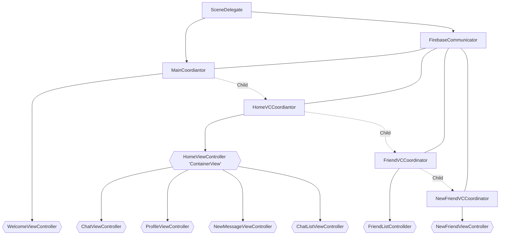

# Tofu
A simple messaging app made in Swift backed by Firebase! This is my first Swift project that represents the extent of what I have learned in the span of 4 months.

There are more screenshots and short gifs below.

# Contents
* [Motivation](#motivation)
* [Architecture](#architecture)
* [Challenges](#challenges)
* [Road Ahead](#road-ahead)
* [Showcase:sparkles:](#showcase)
* [Resources]($resources)

# Motivation

I decided to make a messaging application as my first Swift project because it is simple enough to tackle, yet complex enough as a challenge to learn about Apple's Swift language, specifically the UIKit framework (for now). Actually, my interest was initially devoted to SwiftUI back in 2019 before I realzied that SwiftUI was not mature enough to create a reliable application at the time. So I moved on and focused on my academics.
Fastforward to 2022 January, I decided to revisit Swift and self-teach using various online resources.

# Architecture

- **I prefer setting everything up programmatically, as opposed to using Storyboards and Segues**
- I am following MVVM design pattern with Coordinator pattern (coined and introduced by Soroush Khanlou)
- Delegate pattern (protocol oriented programming)

Here's a quick flowchart illustrating the flow of this app. Each ViewController has its own Coordinator, which acts as a middleman between retrieving/updating/deleting data from Firebase. Each Coordinator class also controls pushing/popping ViewControllers using delegates. 

>Side Note: Did not realize I could create charts using Markdown! This has been a pleasant discovery.

# Challenges

- UIViewController's lifecycle methods are much more than just 'viewDidLoad()'. In my case, these methods are extremely useful when attaching/detaching observer/listener and doing cleanup when a UIViewController is about to go off/on the screen.
- Closures/callbacks! These methods took me a while to fully understand, especially when used in an asynchorous context. 

    > *"What do you mean sometime in the future this closure is going to be triggered?"*

- Animation is a lot harder than SwiftUI.
- Constraints! So powerful, yet so tedious.
- Delegate pattern.
- Optionals vs. uninitialized variable. 'nil' is not the same as uninitilized value.
- Everything we see on screen are layers..?
- 'frame' and 'bounds' are not the same, though they could have the same values.
- Coordinate system in general. 
- "Why is the keyboard covering the UITextField? How am I supposed to see what I am typing?!"

# Road Ahead

There are still many things within Apple's ecosystem that I still need to learn. However after this proejct, I am definitely going to start with CoreData, SwiftUI and CloudKit.

# Showcase

# Resources

* [HackingWithSwift](https://www.hackingwithswift.com)
* [Ray Wenderlich](https://www.raywenderlich.com/books)
* Many YouTube videos
* Many StackOverflow posts
* A little bit of Reddit
* A tiny bit of Quora *(Desperate times calls for desperate measures..)*

