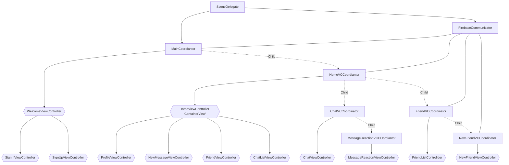

# Tofu
A simple messaging app made in Swift backed by Firebase! This is my first Swift project that represents the extent of what I have learned from Feb 2022 ~ May 2022.

***

# Contents
* [Motivation](#motivation)
* [Architecture](#architecture)
* [Showcase:sparkles:](#showcase)
* [Challenges](#challenges)
* [Road Ahead](#road-ahead)
* [Resources]($resources)

***

# Motivation

I decided to make a messaging application as my first Swift project because it is simple enough to tackle, yet complex enough as a challenge to learn about Apple's Swift language, specifically the UIKit framework (for now). Actually, my interest was initially devoted to SwiftUI back in 2019 before I realzied that SwiftUI was not mature enough to create a reliable application at the time. So I moved on and focused on my academics.
Fastforward to 2022 January, I decided to revisit Swift and self-teach using various online resources.

***

# Architecture

- **I prefer setting everything up programmatically, as opposed to using Storyboards and Segues**
- I am following MVVM design pattern with Coordinator pattern (coined and introduced by Soroush Khanlou)
- Delegate pattern (protocol oriented programming)

Here's a quick flowchart illustrating the flow of this app. Each ViewController has its own Coordinator, which acts as a middleman between retrieving/updating/deleting data from Firebase. Each Coordinator class also controls pushing/popping ViewControllers using delegates. 

>Side Note: Did not realize I could create charts using Markdown! This has been a pleasant discovery.

***

# Showcase 

This is the first UIViewController. It contains two children UIViewControllers, one for signing up, one for signing in. The animated background is made using UIBezierPath and CGPath animation. The CGPath follows a SIN wave function, which varies per each floating bubble. For each child UIViewController, I attach a CAGradientLayer to create a shimmering effect. The background of each sign in/up form is a UIVisualEffectView that has a blurred transparent effect.

---

Following Protocol Oriented Programming design, both of these two UIViewControllers are able to use the same UIVIewControllerAnimatedTransitioning object. The loading circle and checkmark are done using CAShapeLayer, UIBezierPath and CGPath and animated by CABasicAnimation. This was really fun to learn.

***

The main screen of this app shows a HomeViewController, which has two child UIViewControlllers, one showing the list of conversations and the other shows the user's profile when swipe right (inspired by Reddit). In the profile view, the user can tap the 'Friend Requests' button to navigate to the next UIViewController. The transitions here are achived by using UIViewControllerAnimatedTransitioning as well. 

I am using PHPickerViewController to let users select a photo from Photo Gallery. PHPickerViewController does not need user's permission to access the image data from the Photo Gallery, though the user still need to grant permission for PHAsset data.

***

The user can search for other users in Cloud Firestore to send a friend request. I decided to mimic Material Design's button feel when the user send a request.

***

I use UISearchTextField and UISearchToken that Apple finally exposed to UIKit in iOS13. When the user taps on a UITableCell, it creates a UISearchToken and add it to UISearchTextField (like iMessage). I also access these UISearchTokens to create a 'Chat' object and push it to Cloud Firestore.

***

Inspired by iMessage's message reaction, I decided it would be an interesting challenge to mimic the functionality. When the user long presses a message, this begins the transition to the next UIViewController. 

First, I use CoreGraphics to take a screenshot of the entire phone screen, including the NavigationBar, which is ommited when simply using 'snapShotView(afterScreenUpdates: Bool)'. After receiving the screenshot, I use CoreImage's gaussian blur filter so I can have a UIImage with blur effect without UIVisualEffectView overlay. CIFilter also lets us specifies the blur radius, unlike UIVisualEffect which I find too blurry to use in this case.

This effect is done in a fraction of a second thanks to CoreGraphics. The final blurred UIimage is used as the background of the next UIViewController. Next, I calculate the point at which the Reaction Menu expands. This point varies for each message. I calculate this point again when the user taps on a reaction.

***

# Challenges

- UIViewController's lifecycle methods are much more than just 'viewDidLoad()'. In my case, these methods are extremely useful when attaching/detaching observer/listener and doing cleanup when a UIViewController is about to go off/on the screen.
- Closures/callbacks! These methods took me a while to fully understand, especially when used in an asynchorous context. 

    > *"What do you mean sometime in the future this closure is going to be triggered?"*

- Animation is a lot harder than SwiftUI.
- Constraints! So powerful, yet so tedious.
- Delegate pattern.
- Optionals vs. uninitialized variable. 'nil' is not the same as uninitilized value.
- Everything we see on screen are layers..?
- 'frame' and 'bounds' are not the same, though they could have the same values.
- Coordinate system in general. 
- "Why is the keyboard covering the UITextField? How am I supposed to see what I am typing?!"

***

# Road Ahead

Things I want to improve or add:
* Migrate from UITableView to UICollectionView for better animation control
* Implement a better cache to enhance performance
* Allow sending more data types other than text
  - Photo
  - Video
  - Link preview 
* Add notification
* Allow user to change color, font, font size, notification settings
* Add Friend Profile view
  - "Remove Friend" feature 
* Delete Chat feature

***

# Closing

I had a lot of fun learning Swift. Coming from C++ and other older languages, I find Swift very elegant and easy on the eyes; errors are more than easy to identify and locate (so far anyway. I am jinxing myself aren't I?). I would say that I spend about 50% of the time on architecture of my app and 50% on the animations. I have rewritten my app several times during this time as I discover more design patterns or cool ways to animate. I still struggle to keep my code as clean and easy to read as possible, especially when I incorporate more and more animations or functionalities. 

>*This app will not be published to the AppStore and is only for my own personal learning purposes.*

Though this is a long way to go, I might dabble in Adobe After Effects to create my own custom animations and import into a Swift project using Lottie. But for my next step, SwiftUI, CoreData, CloudKit, and CoreML are on the list of things I want to do next!

***

# FAQ

### *What is the meaning behind the name of your app, Tofu?*

>I was already working on my app before I decided an appropriate name because I never want to release this as an official AppStore app. Then one day, I was having a Korean tofu soup for dinner when I decided that I will just simply name my first app "Tofu". 
>
>*Yes, the meaning behind my app is that fact that I like Korean tofu soup.*
>
>Thank you for reading this *engaging and interesting* FAQ section.

***

# Resources

* [HackingWithSwift](https://www.hackingwithswift.com)
* [Ray Wenderlich](https://www.raywenderlich.com/books)
* Many YouTube videos
* Many StackOverflow posts
* A little bit of Reddit
* A tiny bit of Quora *(Desperate times call for desperate measures..)*

